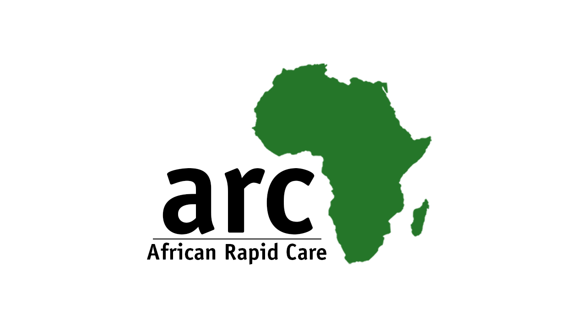
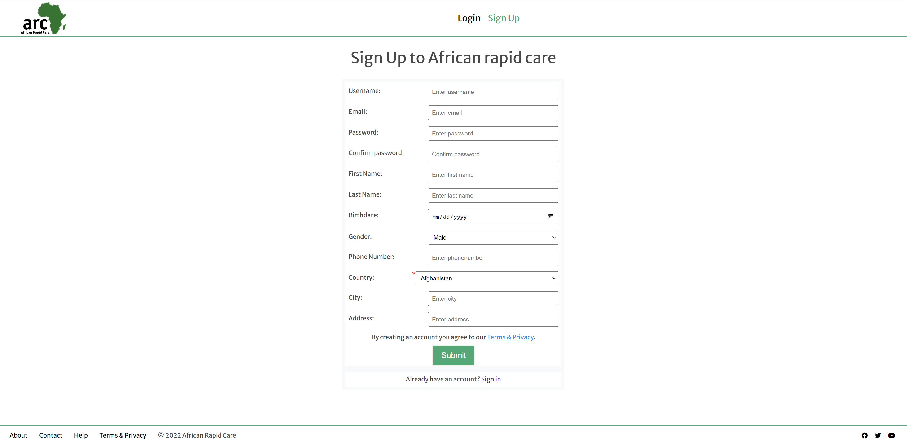
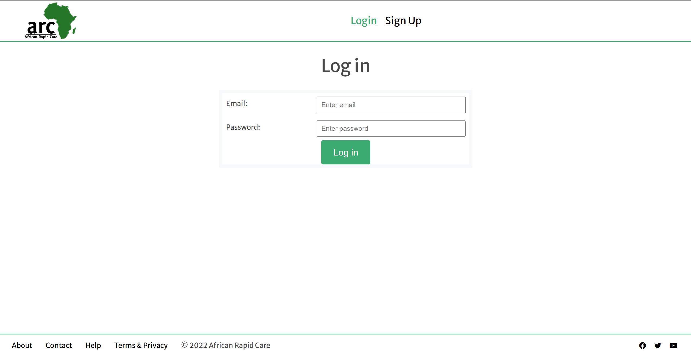
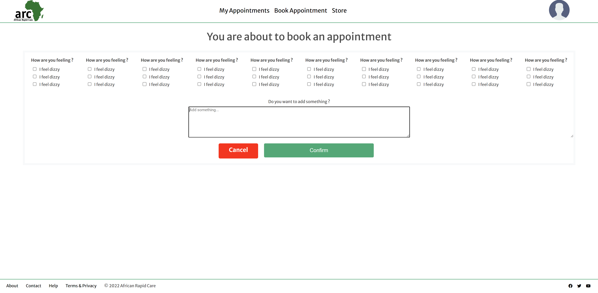
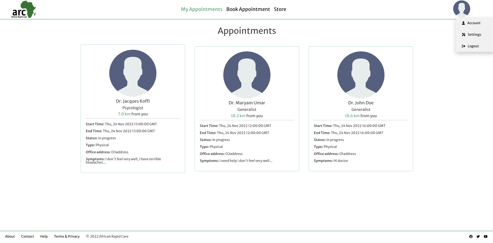
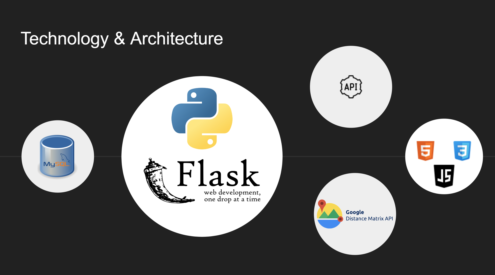
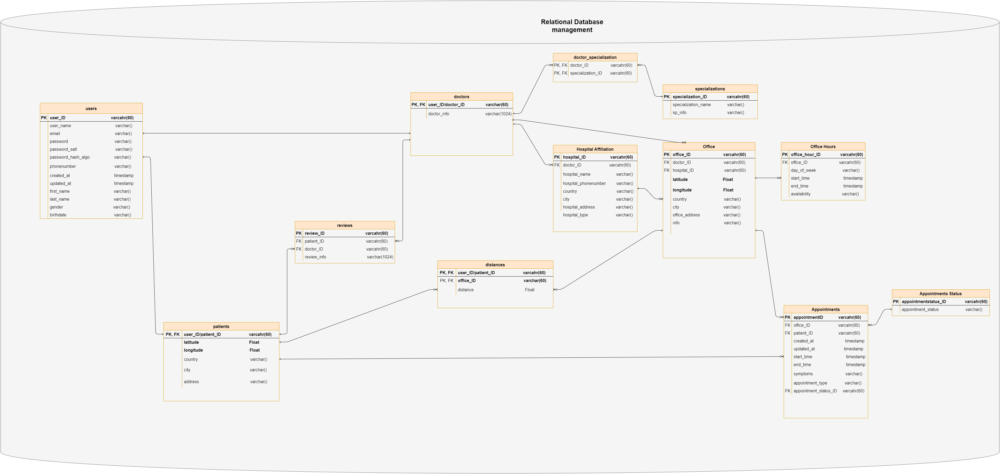

# African Rapid Care ~ A doctor right next door to take care of you!

# Introduction

## The Project
**ARC** is an appointment website where patients in need of health care can quickly find an available and appropriate physician in their vicinity.

Patients can sign up on the website and browse the list of availables doctors. They can book a physical appointment with a doctor focusing on the nearness.
They can see their upcoming appointments and their past appointments, update their profile.

## The Context
This project is our Portfolio Project, concluding our Foundations Year at ALX. We were able to choose our project partners and project topic, as long as we present a working program at the end of the three weeks of development.

## Story behind ARC
Since COVID-19, it has proven necessary to not only have in person  healthcare assistance services but also virtual health care services. With a healthcare website that intends to bridge the gap between time and a user's needs, lives could be saved and better.
Oftentimes when people get sick (nothing too serious but still need to see a doctor), they encounter several challenges trying to get treated as soon as possible. The hospital could be far away from them in the city, there could be a long queue there… This is why we wanted to build **“ARC”** (African Rapid Care).
We aim to use technology to propose sustainable solutions to the problems we face daily in the different aspects of our  lives, the health domain being one of the most important ones. We ceased this opportunity to propose something that has the potential of saving people's lives.

## Our Team
We are a team of two, passionate about providing sustainable solutions to problems around us in order to make life easier and more beautiful for all.

* [**Nabil Affo**](https://nabil2i.github.io/) [@TheNabVerse](https://twitter.com/TheNabVerse) - Author, Poet, Artist , Content Creator, Telecoms & Software Engineer.
* **Imani Omboto** [@Imani Omboto](https://www.linkedin.com/in/imani-omboto-1452b91b9) - Business and Technology Innovator, Software engineer & Graphic designer

## Blog posts
We each wrote a blog post about our ARC journey.

* Nabil's article: [ARC: .....](https://medium.com/)
* Imani's article: [ARC: .....](https://medium.com/)

## Take a tour of the deployed version at [https://african-rapid-care.tk](https://african-rapid-care.tk)

# Features
Here are some features of our web application.

### 1- sign-up
To have access to the service, the user needs to open an account.

### 2- log-in
Once the user has opened an account, they can sign in to use the service offered.

### 3- see-available-doctors
With this feature, the app uses the location of the user, the location of the doctors and the Google Maps Distance Matrix tool to display the available doctors for the user.

### 4- book-appointment
This feature allows the user to book an appointment with a doctor

### 5- see-appointments
This feature allows the user to see all the appointments they've made

### Video showcasing the app
[Click the image below to watch some features in action!](https://youtu.be/Od0vyEPzyhc)

## Known bugs
* The loading of the doctors is not as fluid as expected, API calls can lag.
* There are issues when using on mobile. For example elements being shrinked... 

## Future for the App
For now the app just has some basic features and is developped for a small area only (city), and the narrowed search for doctors (only present in the design) is not yet fully implemented as it wasn't in the MVP. We have the ambition to expand the app to a larger scope, add a tailored search, add more features such as virtual appointments, emergency care and more.

# Architecture

This project has been demanding in the backend.
ARC is a Flask web application built with the following technologies:
## Front End:
- **HTML/CSS** with **Jinja** templating engine for markup and styling of the webpages
- **Javascript** for dynamic content

## REST API & Google Distance Matrix API
- **REST API** with methods GET, POST ... requests are handeled
- **Google Distance Matrix API** is used to compute distance between origins and destinations

## Database
- **MySQL Relationational Database** to store data
- Handle database with ORM (**SQLAlchemy**)

## Back End
- **Flask** web framework based on Python

## Server/Deployment
- Linode Ubuntu 22.04 LTS instance
- Nginx Web server / Gunicorn

# Acknowledegments

* **ALX staff** - For the help, advice and resources they granted us from the beginning of the curriculum and during the project.

* **Cohort 5 and all ALX students** - For your friendship, support throughout the year.

* **YOU, the reader** - For taking the time to go through our project!

# License
**MIT License**
<!-- 
_Permission is hereby granted, free of charge, to any person obtaining a copy of this software and associated documentation files (the "Software"), to deal in the Software without restriction, including without limitation the rights to use, copy, modify, merge, publish, distribute, sublicense, and/or sell copies of the Software, and to permit persons to whom the Software is furnished to do so, subject to the following conditions:_

_The above copyright notice and this permission notice shall be included in all copies or substantial portions of the Software._

_THE SOFTWARE IS PROVIDED "AS IS", WITHOUT WARRANTY OF ANY KIND, EXPRESS OR IMPLIED, INCLUDING BUT NOT LIMITED TO THE WARRANTIES OF MERCHANTABILITY, FITNESS FOR A PARTICULAR PURPOSE AND NONINFRINGEMENT. IN NO EVENT SHALL THE AUTHORS OR COPYRIGHT HOLDERS BE LIABLE FOR ANY CLAIM, DAMAGES OR OTHER LIABILITY, WHETHER IN AN ACTION OF CONTRACT, TORT OR OTHERWISE, ARISING FROM, OUT OF OR IN CONNECTION WITH THE SOFTWARE OR THE USE OR OTHER DEALINGS IN THE SOFTWARE._
-->