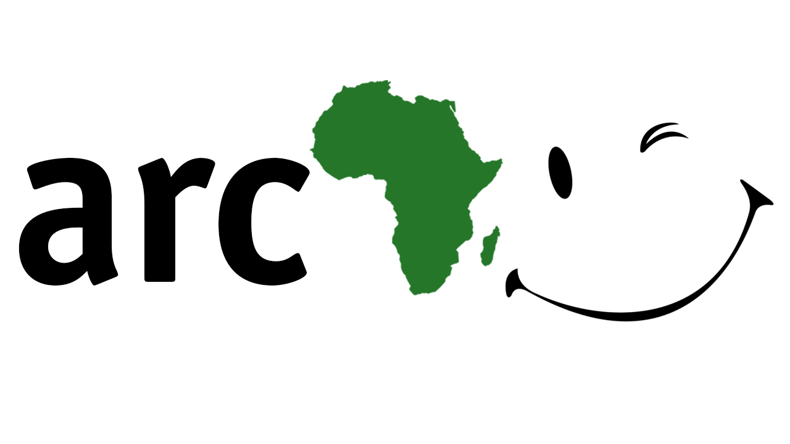
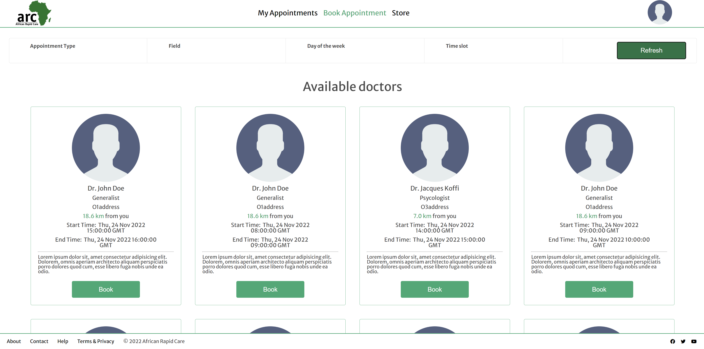
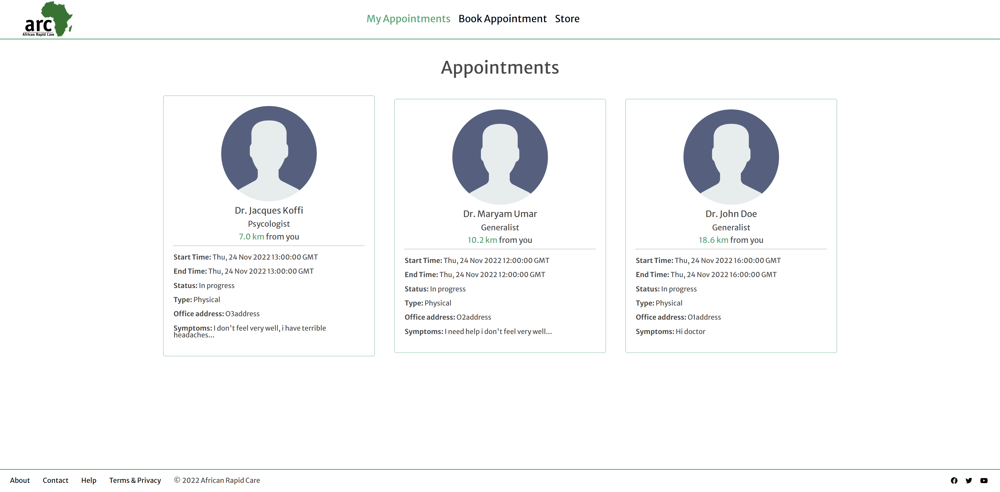

# African_Rapid_Care ~ A doctor right next door to take care of you!

# Introduction

Since COVID-19, it has proven necessary to not only have in person  healthcare assistance services but also virtual health care services. With a healthcare website that intends to bridge the gap between time and a user's needs, lives could be saved and better.
Oftentimes when people get sick (nothing too serious but still need to see a doctor), they encounter several challenges trying to get treated as soon as possible. The hospital could be far away from them in the city, there could be a long queue there…This is why we want to build “ARC” (African Rapid Care).

**ARC** is an appointment website where patients in need of health care can quickly find an available and appropriate physician in their vicinity.

Patients can sign up on the website and browse the list of availables doctors. They can book a physical appointment with a doctor focusing on the nearness.
They can see their upcoming appointments and their past appointments, update their profile.

## The Context
This project is our Portfolio Project, concluding our Foundations Year at ALX. We were able to choose our project partners and project topic, as long as we present a working program at the end of the three weeks of development.

## Take a tour of the deployed version at ...
-> [**ARC**](https://)

# Features

Here are some features of our app:

With this feature, the app uses the location of the user, the location of the doctors and the Google Maps Distance Matrix service to display the available doctors for the user.

This feature allows the user to book an appointment with a doctor

This feature allows the user to see all the appointments they've made

## Known bugs
* The loading of the doctors is not as fluid as expected, API calls can lag.......
* There are issue when using on mobile like............ 

# About

## The story behind ARC

## OurTeam
We are a team of two passionate about providing sustainable solutions to problems around us in order to make life more beautiful for all.

* **Nabil Affo** [@TheNabVerse](https://twitter.com/TheNabVerse) - Author, Poet, Artist , Content Creator, Telecoms & Software Engineer.
* **Imani Omboto** [@](https://twitter.com/) - 

## Blog posts
We each wrote a blog post about our ARC journey.

* Nabil's article: [ARC: .....](https://medium.com/)
* Imani's article: [ARC: .....](https://medium.com/)

# Architecture

# Acknowledgments

* ALX staff - For the help, advice and resources they granted from the begining or the curriculum and during the project

* Cohort 5 and all ALX students - For your friendship, support throughout the year.

* YOU, the reader for taking the time to go through our project !

# License

